# Active Directory Home Lab

## Overview
This project documents the setup and configuration of a fully functional Active Directory home lab environment using Oracle VirtualBox. The lab simulates a real-world corporate IT environment and demonstrates core Help Desk and system administration skills including user management, DHCP configuration, network routing, and domain management.

---

## Tools & Technologies Used
- Oracle VirtualBox
- Windows Server 2019 (Domain Controller)
- Windows 10 (Client Machine)
- Active Directory Domain Services (AD DS)
- DHCP Server
- DNS Server
- Remote Access / NAT (RAS/NAT)
- PowerShell
- Group Policy Management

---

## Network Topology
| Component | Details |
|---|---|
| Domain Name | mydomain.com |
| Domain Controller | Windows Server 2019 |
| Client Machine | Windows 10 (CLIENT1) |
| DHCP Scope | 172.16.0.100 – 172.16.0.200 |
| Network Adapter 1 | NAT (Internet access) |
| Network Adapter 2 | Internal Network (intnet) |

---

## Lab Setup

### Step 1: VirtualBox Installation
- Installed Oracle VirtualBox on host machine
- Created two virtual machines:
  - **DC** — Domain Controller running Windows Server 2019
  - **CLIENT1** — Client machine running Windows 10
- Configured DC with 2 network adapters (NAT + Internal Network) and 4GB RAM

### Step 2: Windows Server 2019 Installation
- Installed Windows Server 2019 on the DC virtual machine
- Configured administrator password
- Renamed the server for identification

### Step 3: Network Configuration
- Identified and renamed network adapters:
  - **INTRENET** — Internal network adapter (for domain communication)
  - **Ethernet 2** — NAT adapter (for internet access)
- Assigned a static IP address to the internal network adapter

---

## Active Directory Configuration

### Step 4: Installing Active Directory Domain Services
- Opened Server Manager
- Installed the **Active Directory Domain Services** role via Add Roles and Features
- Promoted the server to a **Domain Controller**
- Created a new forest with the domain name **mydomain.com**
- Server restarted and logged in as domain administrator

### Step 5: Creating Admin Account
- Opened Active Directory Users and Computers
- Created a new Organizational Unit called **_ADMINS**
- Created a new domain admin user account
- Added the account to the **Domain Admins** security group

---

## RAS/NAT Configuration

### Step 6: Installing Remote Access (RAS/NAT)
- Installed the **Remote Access** role with the **Routing** feature
- Configured NAT to allow the Windows 10 client to access the internet through the Domain Controller
- Verified Routing and Remote Access was successfully configured

---

## DHCP Configuration

### Step 7: Installing and Configuring DHCP
- Installed the **DHCP Server** role via Server Manager
- Created a new IPv4 DHCP scope:
  - **Scope Range:** 172.16.0.100 – 172.16.0.200
  - **Subnet Mask:** 255.255.255.0
  - **Default Gateway:** 172.16.0.1
  - **DNS Server:** 172.16.0.1
- Authorized the DHCP server in Active Directory
- Confirmed scope status shows as **Active**

---

## PowerShell User Creation

### Step 8: Bulk Creating Users with PowerShell
- Used a PowerShell script to automatically create **1,000+ user accounts** in Active Directory
- Script created users in the **_USERS** Organizational Unit
- Each user was assigned a standardized username format and default password
- Verified all users were successfully created in Active Directory Users and Computers

---

## Windows 10 Client Setup

### Step 9: Installing Windows 10 Client
- Created a new VM (CLIENT1) with Windows 10
- Configured network adapter to use the **Internal Network** to communicate with the Domain Controller
- Completed Windows 10 setup

### Step 10: Joining the Domain
- Navigated to System Properties on the Windows 10 client
- Changed membership from Workgroup to **Domain: mydomain.com**
- Entered domain admin credentials
- Received **"Welcome to the mydomain.com domain"** confirmation
- Restarted the client machine
- Verified CLIENT1 appeared in **Active Directory Users and Computers** under the Computers OU

### Step 11: Logging In with Domain Account
- Logged into Windows 10 client using a domain user account
- Confirmed **"Sign in to: MYDOMAIN"** on the login screen
- Verified domain login was successful

---

## Help Desk Simulation

### Step 12: Password Reset
- Located a user account in Active Directory Users and Computers
- Right-clicked the user and selected **Reset Password**
- Set a new password and confirmed the change
- Received confirmation: *"The password for [user] has been changed"*

### Step 13: Disabling a User Account
- Located a user account in Active Directory Users and Computers
- Right-clicked the user and selected **Disable Account**
- Received confirmation: *"Object [user] has been disabled"*

### Step 14: Unlocking a User Account
- Opened user Properties in Active Directory Users and Computers
- Navigated to the **Account** tab
- Located the **"Unlock account"** checkbox
- Demonstrated the account unlock process

### Step 15: Creating a New User
- Right-clicked the **_USERS** Organizational Unit
- Selected **New > User**
- Filled in first name, last name, and user logon name
- Created the user in **mydomain.com/_USERS**
- Confirmed new user appeared in Active Directory

---

## Key Skills Demonstrated
- Deploying and configuring Windows Server 2019
- Installing and managing Active Directory Domain Services
- Configuring DHCP scopes and authorizing DHCP servers
- Setting up NAT/RAS for network routing
- Using PowerShell to automate bulk user creation
- Joining client machines to a Windows domain
- Performing core Help Desk tasks in Active Directory:
  - Password resets
  - Account disabling/enabling
  - Account unlocking
  - New user creation

---

## Screenshots

### 1. Windows Server Desktop

### 2. Server Manager
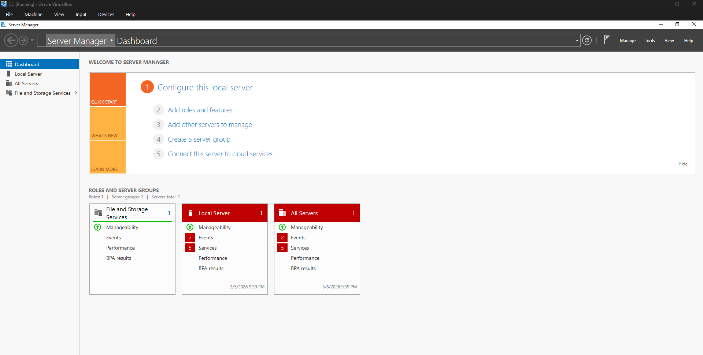

### 3. RAS Remote Access Installed

### 4. DHCP Installed
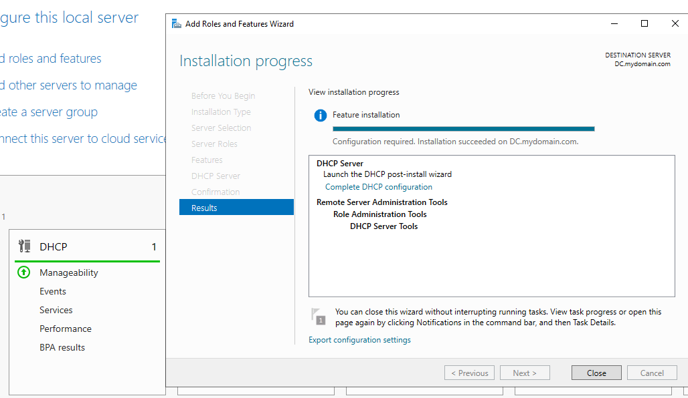

### 5. DHCP Scope Active
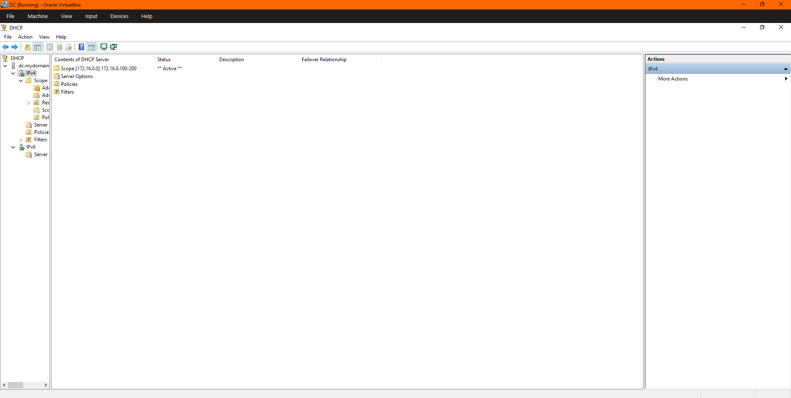

### 6. PowerShell Bulk Users
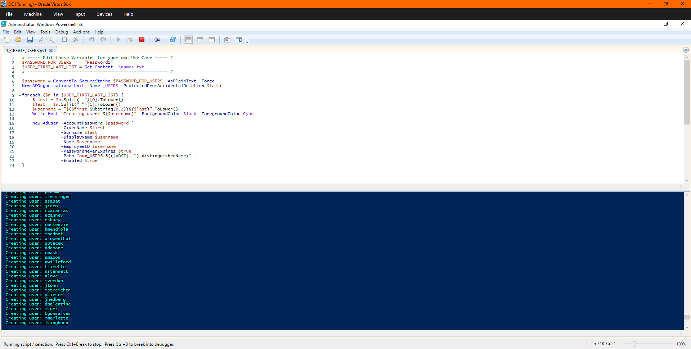

### 7. Active Directory Users
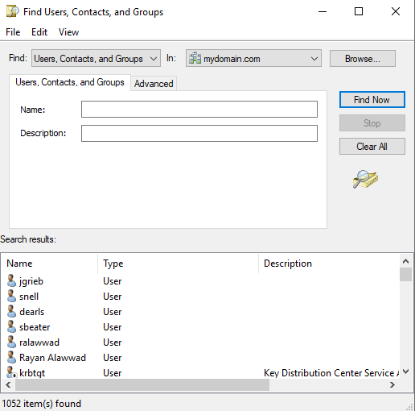

### 8. 1052 Users Found
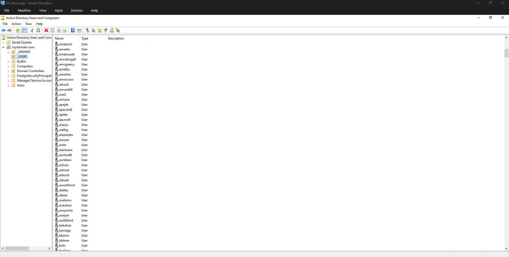

### 9. Windows 10 Client Desktop
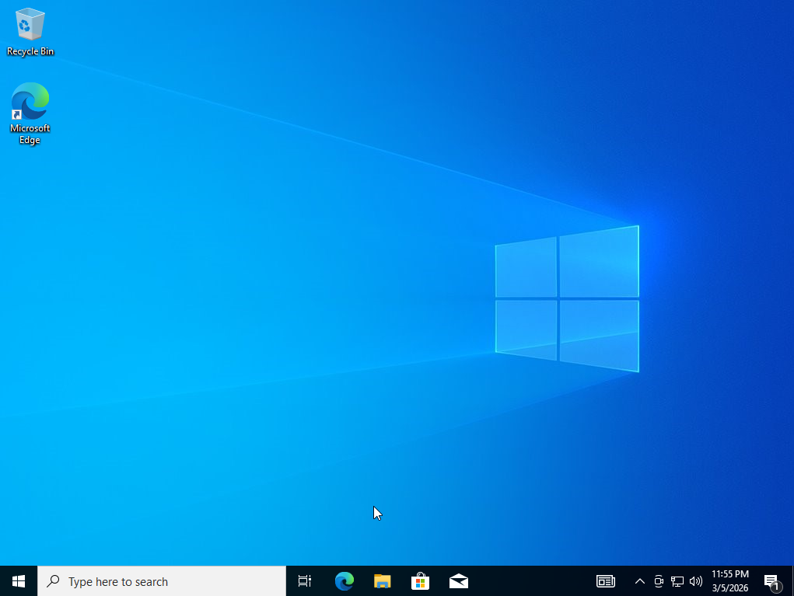

### 10. Domain Join Confirmation
.png)

### 11. Windows 10 Desktop
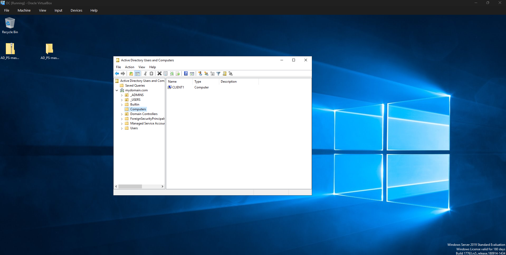

### 12. Both VMs Running
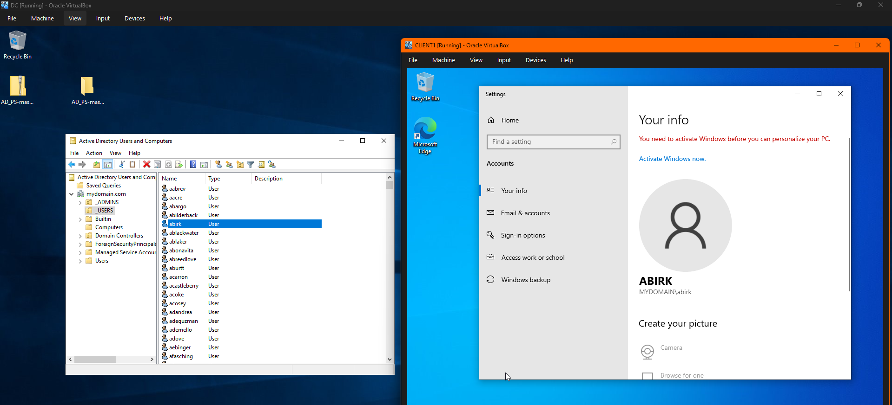

### 13. Server Manager All Green
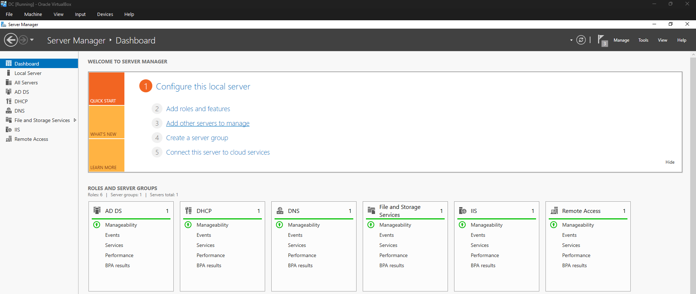

### 14. Password Reset
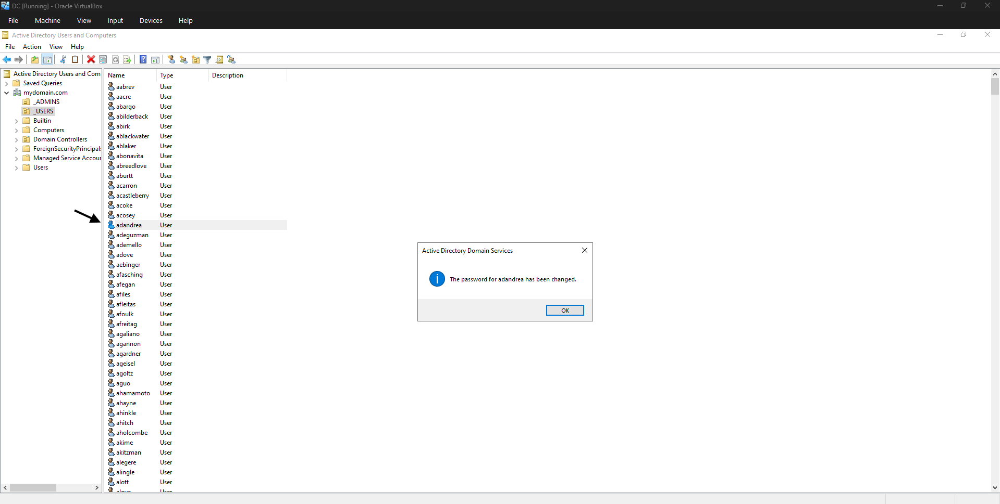

### 15. Disable User
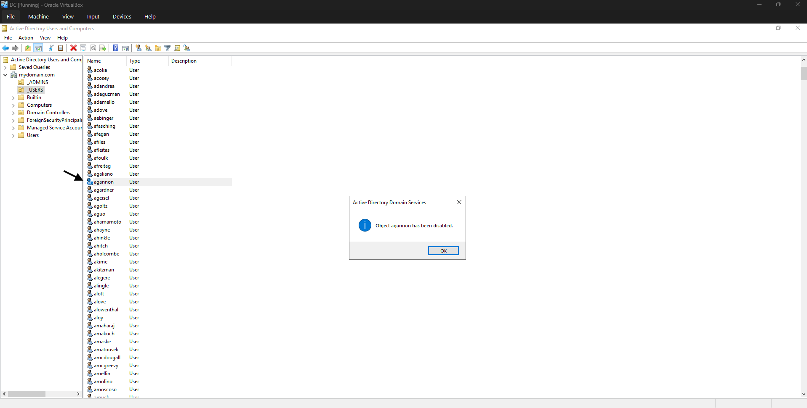

### 16. Unlock Account
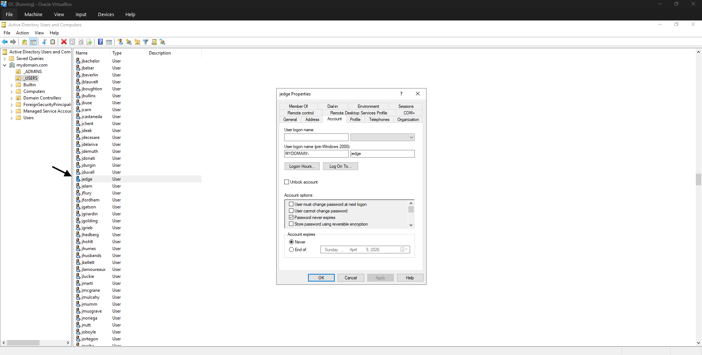

### 17. New User Creation
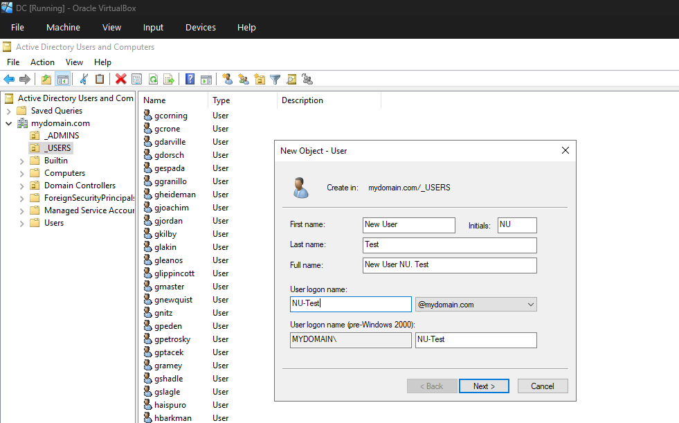

### 18. New User Properties
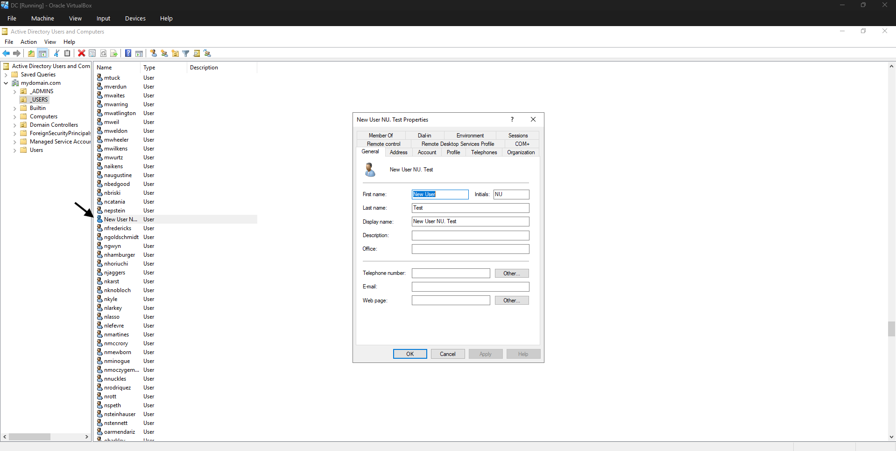
